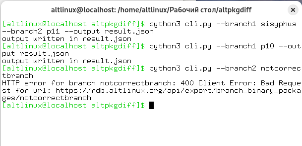

# altpkgdiff
A Python Module with CLI tool to compare binary packages between two ALT Linux branches using the public REST API:  
https://rdb.altlinux.org/api/

Supports full comparison per architecture, highlighting:

- Packages only in branch1
- Packages only in branch2
- Packages with newer version-release in branch1

Version comparison follows RPM versioning rules



---

## Table of Contents

- [Requirements](#requirements)
- [Usage](#usage)
- [Output format](#output-format)
- [Example](#example)
- [Implementation Notes](#implementation-notes)
- [TODO](#todo)

---

## Requirements

- `Python 3.8+`
- `requests`
- `rpm-vercmp`

Install dependencies:

```bash
pip install -r requirements.txt
```

---

## Usage

### Basic usage

```bash
python3 cli.py
```

Compares `sisyphus` and `p11` by default.

### Custom branches

```bash
python3 cli.py --branch1 p11 --branch2 p10
```

### Output to file

```bash
python3 cli.py --branch1 p10 --branch2 p9 --output result.json
```

---

## Output format

The result as JSON contains:

```json
{
  "branch1": "p11",
  "branch2": "sisyphus",
  "results": {
    "x86_64": {
      "only_in_branch1": [
        {
          "name": "package-name",
          "version": "package-version",
          "release": "package-release"
        }],
      "only_in_branch2": [
        {
          "name": "package-name",
          "version": "package-version",
          "release": "package-release"
        }],
      "newer_in_branch1": [
        {
          "name": "package-name",
          "version": "package-version",
          "release": "package-release"
        }]
    },
    "aarch64": {
      ...
    },
    ...
  }
}
```

---

## Example

```bash
python3 cli.py --branch1 p11 --branch2 sisyphus
```

Output:

```json
{
  "branch1": "p11",
  "branch2": "sisyphus",
  "results": {
    "x86_64": {
      "only_in_branch1": [...],
      "only_in_branch2": [...],
      "newer_in_branch1": [...]
    },
    ...
  }
}
```
Example 2
---
If the output file is specified
```bash
python3 cli.py --output result.json
```

Output:

```
output written in result.json
```
JSON from Example 1 would be written in `result.json`

---

## Implementation Notes

The tool is split into two parts:
  - A pure Python module (`altpkgdiff.py`) responsible for fetching and comparing data
  - A CLI wrapper (`cli.py`) that handles arguments and outputs JSON

Version comparison is done using the `rpm-vercmp` library, which correctly handles RPM's versioning semantics

The main comparison function (`compare_branches`) returns a plain Python dictionary, making it reusable in other contexts (testing, integration into other tools)

The CLI layer wraps this dictionary into a final JSON structure that includes branch names, making output self-descriptive

The tool compares packages per architecture (`arch`)

Errors during fetching are wrapped in a custom exception `FetchError` for clean error handling in the CLI

---

## TODO

* [ ] Add unit tests for version comparison
* [ ] Add CLI entrypoint
* [ ] Add "--advanced" parameter to get additional package info (for ex. `pkg["epoch"]`)